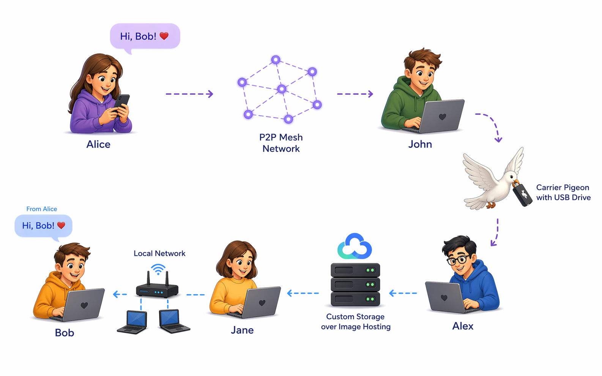

# DDM (DoomsDay Messenger)

An anonymous and secure messenger designed to deliver messages both when the internet is available and when it is not.

## Download

You can download complied binaries from the latest [release](https://github.com/waus/ddm/releases/latest).
All binaries are compiled by Github CI releases so if you don't trust to release page you can downdload them directly from [CI artifacts](https://github.com/waus/ddm/actions/workflows/release.yml).

## Concept

The project is focused on:
- participant anonymity;
- secure message delivery;
- operation in unstable and partially unavailable networks;
- equally important online and offline-first delivery scenarios.
- transports implementation independence and different transports convergence.

## Prerequisites and sources of ideas

- Bitmessage
- SSB (Secure Scuttlebutt)

These systems are treated as architectural and protocol references for designing transport, replication, delivery queues, and privacy.

## Reference implementations

Split into two parts:
- the core in Dart as a separate package;
- the client application in Flutter.

Location:
- Dart core: [`ddm_proto_dart/`](./ddm_proto_dart)
- Flutter client: [`app/`](./app)

## Fixed stack

- data encryption: `age`;
- key exchange: `X25519`;
- signature: `Ed25519`;
- base p2p exchange and transport layer: `libp2p`;
- global configuration distribution: developer-signed config timeline objects,
  replicated through the same channels as messages;
- local storage: `SQLite`;

## Contributing

We are open to any contributions limited by UI/UX scope. 
Please create tasks with feature requests and bug reports, send pull requests with fixes and improvements.