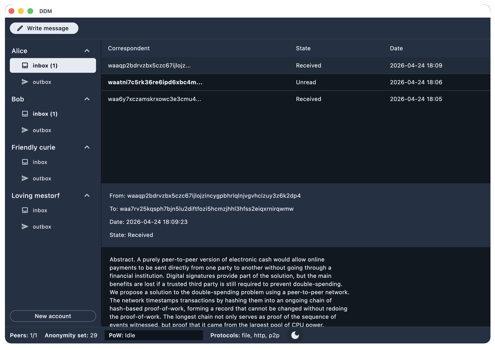

# DDM Flutter App



Flutter client shell for the DDM Dart core.

Generated runners:

- Android
- iOS
- Linux
- macOS

Useful local commands:

```sh
/Users/user/sdk/flutter/bin/flutter pub get
/Users/user/sdk/flutter/bin/flutter analyze
/Users/user/sdk/flutter/bin/flutter test
/Users/user/sdk/flutter/bin/flutter run -d macos
/Users/user/sdk/flutter/bin/flutter build macos
/Users/user/sdk/flutter/bin/flutter build apk --debug
/Users/user/sdk/flutter/bin/flutter build ios --no-codesign
```
